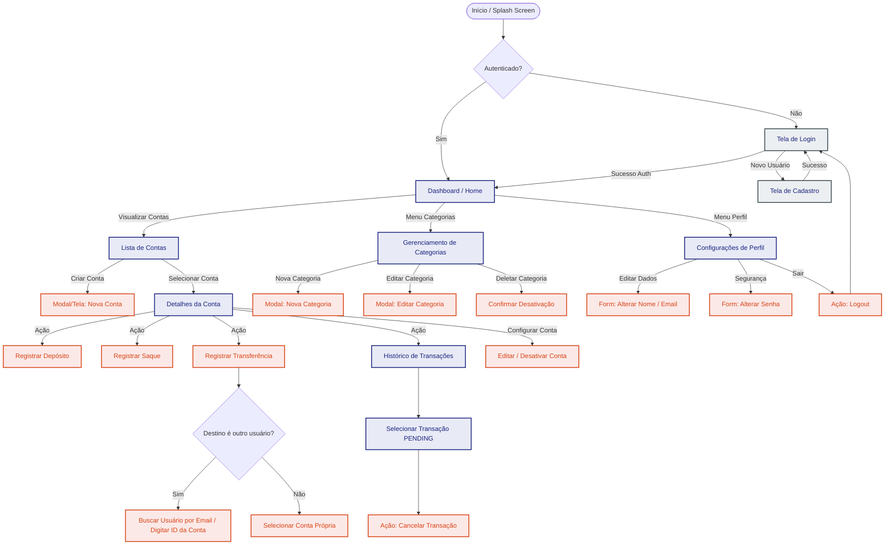

# Minty - Sistema de Controle Financeiro & Transferências P2P

> [!WARNING]
> **Status de Desenvolvimento**: O projeto encontra-se em **desenvolvimento ativo**. O backend possui sua estrutura lógica de domínios e Casos de Uso bem delineada, enquanto o frontend está em fase inicial de estruturação. Como o projeto está em constante evolução, a arquitetura, regras de negócio e endpoints expostos **podem sofrer alterações futuras**.

O **Minty** é uma aplicação de controle financeiro pessoal e transferências ponto a ponto (P2P). O projeto está estruturado em duas partes principais: um **backend** desenvolvido em PHP (Symfony) que segue princípios de Clean Architecture/DDD, e um **frontend** desenvolvido em Angular (v21) com Tailwind CSS v4.

Este documento fornece uma análise detalhada da arquitetura do projeto, mapeia a API do backend, descreve as regras de domínio com base no arquivo de experiência do usuário ([USER_EXPERIENCE.md](file:///home/lucas/projects/PHP/Minty/USER_EXPERIENCE.md)) e apresenta instruções para execução e desenvolvimento local.


---

## 📁 Estrutura do Projeto

O repositório está estruturado da seguinte forma:

```
Minty/
├── backend/            # API REST construída em PHP e Symfony
│   ├── src/
│   │   ├── App/        # Camada de Aplicação: Casos de Uso (Usecases), DTOs e Segurança
│   │   ├── Domain/     # Camada de Domínio: Entidades, Value Objects e Contratos (Repository)
│   │   └── Infra/      # Camada de Infraestrutura: Controladores, Entidades/Mapeadores de Banco e Configurações
│   └── tests/          # Testes automatizados com PHPUnit
├── frontend/           # Aplicação SPA construída em Angular
│   ├── src/
│   │   ├── app/        # Estrutura Angular: Componentes de Layout (Header, Footer, Sidebar), Páginas
│   │   ├── index.html
│   │   ├── main.ts
│   │   └── styles.scss # Estilos globais (integração do Tailwind CSS v4)
│   └── package.json
└── USER_EXPERIENCE.md  # Regras de Negócio e Especificações de UX
```

---

## 🏛️ Análise Arquitetural e de Tecnologias

### ⚙️ Backend (Symfony + Doctrine)
O backend é projetado em torno de práticas de Clean Architecture e Domain-Driven Design (DDD). Isso se reflete na separação clara de responsabilidades:
*   **Domínio Independente**: A pasta [Domain](file:///home/lucas/projects/PHP/Minty/backend/src/Domain/) abriga as entidades puras (como `User`, `Account`, `Category` e `Transaction`) e as interfaces dos repositórios. Elas não possuem acoplamento com o banco de dados.
*   **Casos de Uso (Use Cases)**: Localizados em [App/Usecases](file:///home/lucas/projects/PHP/Minty/backend/src/App/Usecases/), eles representam as intenções e ações de negócio (ex: realizar saques, transferências, depósitos, logins), isolando a lógica de negócio dos controladores HTTP.
*   **Mapeamento de Banco de Dados**: A infraestrutura de banco utiliza o **Doctrine ORM 3.x**. Para manter as entidades de domínio puras, o projeto utiliza entidades separadas para persistência em [Infra/Db/Entity](file:///home/lucas/projects/PHP/Minty/backend/src/Infra/Db/Entity/) (ex: `UserEntity`, `AccountEntity`) que são mapeadas a partir das entidades de domínio via mappers específicos.
*   **Segurança e Autenticação**: Protegida com **Tokens JWT** (Firebase JWT) injetados e validados por meio de um atributo customizado de rota `#[RequiresAuth]` configurado no nível do Symfony.
*   **Documentação**: Integração com OpenAPI (Swagger) via `NelmioApiDocBundle` para documentação viva e interativa da API REST.

### 🎨 Frontend (Angular 21 + Tailwind CSS v4)
> [!NOTE]
> **Em Desenvolvimento**: O frontend está em fase inicial de estruturação (esqueleto da aplicação). Os componentes, roteamentos e integrações com o backend estão sob desenvolvimento ativo e sujeitos a refatorações.
*   **Modernidade com Angular**: Configurado para utilizar a versão **21.x** do Angular, aproveitando componentes standalones e recursos reativos modernos como Signals para controle de estado.
*   **Estilização Premium**: Emprega o **Tailwind CSS v4.0** integrado diretamente com PostCSS no pipeline de compilação, proporcionando um ambiente de estilização rápido, moderno e livre de configurações pesadas.
*   **Layout Modular**: A interface possui um esqueleto de navegação constituído por componentes em `components/` ([Header](file:///home/lucas/projects/PHP/Minty/frontend/src/app/components/header/), [Footer](file:///home/lucas/projects/PHP/Minty/frontend/src/app/components/footer/) e [Sidebar](file:///home/lucas/projects/PHP/Minty/frontend/src/app/components/sidebar/)) e uma tela inicial de [Login](file:///home/lucas/projects/PHP/Minty/frontend/src/app/login/).
*   **Testes Ágeis**: Substituição do Karma tradicional pelo **Vitest**, fornecendo testes unitários mais rápidos para a aplicação.

---

## 💼 Regras de Negócio e Domínio (Base: USER_EXPERIENCE.md)

Com base no mapeamento do arquivo de especificações de UX do projeto, as entidades possuem as seguintes restrições e comportamentos:

### 1. Usuário (`User`)
*   **Cadastro**: O nome e o e-mail do usuário devem ser únicos no sistema.
*   **Perfil**: Permite a alteração independente de nome, e-mail e senha.

### 2. Conta Financeira (`Account`)
*   **Valor Monetário**: O saldo é representado por um valor inteiro em centavos (`Money`) para mitigar problemas com pontos flutuantes.
*   **Saldo Inicial**: Definido obrigatoriamente e apenas na criação da conta.
*   **Inativação Lógica**: Quando uma conta é removida, ela é inativada logicamente (`isActive = false`). As transações históricas permanecem salvas no banco de dados para consistência de relatórios, mas novas movimentações financeiras na conta são bloqueadas.

### 3. Categoria (`Category`)
*   **Organização**: Categorias classificam transações (Entradas/Saídas).
*   **Inativação**: Funciona por meio de inativação lógica (`isActive = false`) para garantir que transações passadas não fiquem órfãs.

### 4. Transação (`Transaction`)
*   **Tipagem**: Depositar (Entrada), Sacar (Saída) e Transferir (Saída na origem e Entrada no destino).
*   **Status**: `PENDING`, `DONE` ou `CANCELLED`.
*   **Cancelamento**: O usuário pode cancelar transações financeiras apenas se estiverem no estado `PENDING`. As transações marcadas como `DONE` ou `CANCELLED` não podem ser alteradas.

---

## 🛣️ Mapa de Rotas e Endpoints da API

Os seguintes endpoints do backend em PHP/Symfony estão mapeados para os Casos de Uso correspondentes:

| Módulo | Método | Endpoint | Ação / Caso de Uso Relacionado |
| :--- | :--- | :--- | :--- |
| **Auth** | `POST` | `/login` | Autenticação inicial (gera Token JWT) |
| | `POST` | `/logout` | Invalida a sessão/token JWT atual |
| | `POST` | `/refresh` | Atualiza um token JWT expirado |
| **Usuário** | `POST` | `/users` | Cadastro de novos usuários |
| | `GET` | `/users/me` | Retorna dados do perfil logado |
| | `PATCH` | `/users/name` | Altera o nome do perfil |
| | `PATCH` | `/users/email` | Altera o e-mail do perfil |
| | `PATCH` | `/users/password` | Altera a senha do perfil |
| | `GET` | `/users/search` | Busca usuários cadastrados por e-mail |
| **Contas** | `POST` | `/accounts` | Criação de nova conta com saldo inicial |
| | `GET` | `/accounts` | Listagem de contas associadas ao usuário |
| | `GET` | `/accounts/{id}` | Busca detalhes de uma conta específica |
| | `PATCH` | `/accounts/{id}` | Edição do nome da conta |
| | `DELETE` | `/accounts/{id}` | Inativação lógica da conta (`isActive = false`) |
| **Transações**| `POST` | `/accounts/{id}/deposit` | Realiza um depósito (Entrada) |
| | `POST` | `/accounts/{id}/withdraw`| Realiza um saque (Saída) |
| | `POST` | `/accounts/{id}/transfer`| Transfere saldo para outra conta (P2P ou própria) |
| | `GET` | `/accounts/{id}/transactions`| Histórico e extrato de transações |
| **Categorias**| `POST` | `/categories` | Cadastro de nova categoria de transação |
| | `GET` | `/categories` | Listagem de categorias do usuário |
| | `PATCH` | `/categories/{id}` | Edição de nome e descrição de categoria |
| | `DELETE` | `/categories/{id}` | Inativação lógica da categoria (`isActive = false`) |

---

## 🎨 Fluxo de Navegação e UX Proposto

Para guiar a implementação da interface do usuário no Angular, adotam-se as seguintes regras de experiência:

1.  **Chaves P2P (Transferências)**: A UI deve prover campo para digitar o e-mail de destino (pesquisando via `/users/search`) ou digitar/colar o UUID exato da conta destino (ex: via leitura de QR Code ou código copiado).
2.  **Tratamento de Contas/Categorias Desativadas**:
    *   Ocultar itens desativados (`isActive = false`) nas telas padrão de transação.
    *   Criar uma tela de "Arquivo" ou filtro na listagem geral para que o usuário veja itens inativos.
    *   Contas inativas devem constar visualmente como "Inativas", com botões de depósito, saque e transferência bloqueados.
3.  **Controle de Transações**: Transações com status `PENDING` devem exibir um botão vermelho ou link chamativo para "Cancelar Transação". Itens com status `DONE` ou `CANCELLED` tornam-se apenas informativos.

### Diagrama de Navegação (Mermaid)



---

## 🚀 Como Executar o Projeto Localmente

### Pré-requisitos
*   **PHP** >= 8.2
*   **Composer** (Gerenciador de dependências PHP)
*   **Node.js** >= 18 e **npm** >= 9
*   **Angular CLI** (opcional, pois roda local via scripts do package.json)

### 1. Inicializando o Backend (API)
1.  Navegue até a pasta:
    ```bash
    cd backend
    ```
2.  Instale as dependências:
    ```bash
    composer install
    ```
3.  Configure as variáveis de ambiente:
    ```bash
    cp .env.example .env
    ```
    *Edite o arquivo `.env` para definir chaves de criptografia e a `DATABASE_URL` (pode ser configurada com SQLite ou MySQL).*
4.  Crie as tabelas do banco de dados utilizando os schemas do Doctrine ORM:
    ```bash
    php bin/console doctrine:schema:update --force
    ```
5.  Inicie o servidor local de desenvolvimento do PHP:
    ```bash
    php -S localhost:8000 index.php
    ```
    *A API backend estará rodando no endereço `http://localhost:8000`.*

### 2. Inicializando o Frontend (Interface)
1.  Navegue até a pasta:
    ```bash
    cd frontend
    ```
2.  Instale as dependências npm:
    ```bash
    npm install
    ```
3.  Inicie o servidor de desenvolvimento:
    ```bash
    npm start
    ```
    *A interface gráfica estará acessível em `http://localhost:4200`.*

---

## 🧪 Rodando os Testes Automatizados

*   **Testes do Backend (PHPUnit)**:
    ```bash
    cd backend
    vendor/bin/phpunit
    ```
*   **Testes do Frontend (Vitest)**:
    ```bash
    cd frontend
    npm test
    ```
