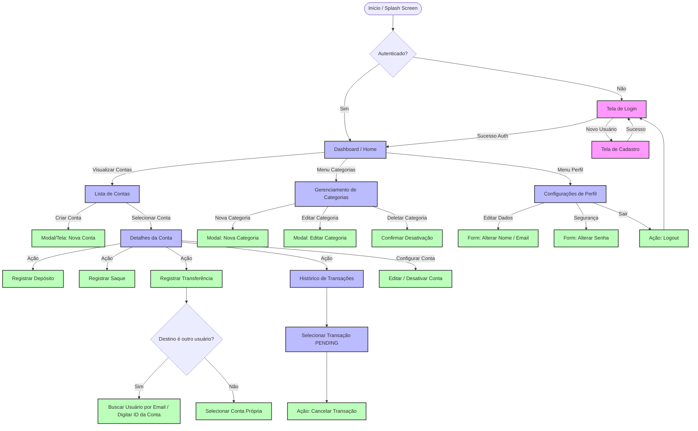

# Resumo para Desenho de Fluxo de Navegação e UX - Minty

Este documento apresenta o mapeamento completo das regras de negócio, entidades e rotas da API do backend do **Minty** para servir de base no desenho do fluxo de navegação e na experiência do usuário (UX).

---

## 1. Entidades de Domínio e Atributos

Com base no código do backend, o sistema é estruturado em torno das seguintes entidades:

### Usuário ([User](file:///home/lucas/projects/PHP/Minty/backend/src/Domain/Entities/User.php))
Representa a conta do usuário no sistema.
- **Atributos**: ID (UUID), Nome, E-mail, Senha (criptografada).
- **Regras**:
  - O e-mail e nome devem ser únicos (validados na criação/edição).
  - É possível atualizar o nome, e-mail e senha de forma independente.

### Conta Financeira ([Account](file:///home/lucas/projects/PHP/Minty/backend/src/Domain/Entities/Account.php))
Contas bancárias ou carteiras criadas pelo usuário.
- **Atributos**: ID (UUID), Nome (ex: "Carteira", "Poupança"), Saldo (inteiro representando centavos/Money), Dono (userId), Ativa (isActive).
- **Regras**:
  - Saldo inicial é definido na criação.
  - Apenas contas ativas podem receber transações (depósito, saque, transferência).
  - A desativação é uma **inativação lógica** (`isActive = false`). A conta e suas transações permanecem salvas para fins de histórico e persistência de dados, mas novas movimentações são totalmente bloqueadas.

### Categoria ([Category](file:///home/lucas/projects/PHP/Minty/backend/src/Domain/Entities/Category.php))
Categorias para classificação das transações.
- **Atributos**: ID (UUID), Nome (ex: "Alimentação", "Lazer"), Descrição (opcional), Dono (userId), Ativa (isActive).
- **Regras**:
  - Podem ser ativadas e desativadas a qualquer momento (inativação lógica).

### Transação ([Transaction](file:///home/lucas/projects/PHP/Minty/backend/src/Domain/Entities/Transaction.php))
Movimentações financeiras associadas a uma conta.
- **Atributos**: ID (UUID), Conta Origem (accountId), Valor (Money), Tipo (`INFLOW` / Entrada ou `OUTFLOW` / Saída), Status (`PENDING`, `DONE`, `CANCELLED`), Descrição (opcional), Categoria (categoryId), Data de Criação (createdAt).
- **Regras**:
  - Criadas através de Depósitos (Inflow), Saques (Outflow) ou Transferências (gera Outflow na origem e Inflow no destino).
  - Transações no status `PENDING` podem ser canceladas pelo usuário.

---

## 2. Mapa de Rotas e Funcionalidades do Backend

Estas são as rotas expostas em nossos controladores ([AuthController](file:///home/lucas/projects/PHP/Minty/backend/src/Infra/Http/Controller/AuthController.php), [UserController](file:///home/lucas/projects/PHP/Minty/backend/src/Infra/Http/Controller/UserController.php), [AccountController](file:///home/lucas/projects/PHP/Minty/backend/src/Infra/Http/Controller/AccountController.php), [CategoryController](file:///home/lucas/projects/PHP/Minty/backend/src/Infra/Http/Controller/CategoryController.php)):

| Módulo | Método | Endpoint | Ação / Usecase Relacionado |
| :--- | :--- | :--- | :--- |
| **Auth** | `POST` | `/login` | Autenticação inicial (gera Token JWT) |
| | `POST` | `/logout` | Invalida a sessão atual |
| | `POST` | `/refresh` | Atualiza o token expirado |
| **Usuário** | `POST` | `/users` | Cadastro de novo usuário |
| | `GET` | `/users/me` | Obter dados do usuário logado |
| | `PATCH` | `/users/name` | Alterar nome do perfil |
| | `PATCH` | `/users/email` | Alterar e-mail do perfil |
| | `PATCH` | `/users/password` | Alterar senha |
| | `GET` | `/users/search` | Buscar usuários por e-mail |
| **Contas** | `POST` | `/accounts` | Criar nova conta |
| | `GET` | `/accounts` | Listar contas do usuário logado |
| | `GET` | `/accounts/{id}` | Detalhes de uma conta específica |
| | `PATCH` | `/accounts/{id}` | Renomear conta |
| | `DELETE` | `/accounts/{id}` | Desativar conta (inativação lógica) |
| **Transações** | `POST` | `/accounts/{id}/deposit` | Realizar depósito em uma conta |
| | `POST` | `/accounts/{id}/withdraw` | Realizar saque de uma conta |
| | `POST` | `/accounts/{id}/transfer` | Transferir saldo para outra conta (própria ou de terceiros) |
| | `GET` | `/accounts/{id}/transactions` | Listar histórico de transações da conta |
| **Categorias** | `POST` | `/categories` | Criar nova categoria |
| | `GET` | `/categories` | Listar categorias do usuário |
| | `PATCH` | `/categories/{id}` | Editar nome/descrição da categoria |
| | `DELETE` | `/categories/{id}` | Desativar categoria (inativação lógica) |

---

## 3. Diagrama do Fluxo de Navegação Sugerido

O fluxo a seguir mapeia a experiência de navegação do usuário do momento em que abre o app até as ações internas, incluindo transferências P2P (para outros usuários) e o fluxo de cancelamento de transações:

---

## 4. Definições de UX (Experiência do Usuário) Implementadas

### 👥 Transferência entre Usuários (P2P)
- **Identificação da Conta Destino**: O backend realiza a transferência associando dois IDs de conta (`fromAccountId` e `toAccountId`). Como a busca de usuário `/users/search` retorna apenas os dados de perfil (Nome, E-mail, ID de Usuário), o fluxo de UX deve permitir:
  1. A inserção direta do ID da Conta de destino (ex: via compartilhamento de "código/chave da conta" ou QR Code contendo o UUID da conta).
  2. Opcionalmente, selecionar a partir de um usuário encontrado por e-mail, caso haja suporte futuro a "conta padrão" vinculada a este usuário.

### 🗑️ Desativação Lógica de Contas e Categorias
- **Visualização Diferenciada**: Contas e categorias com `isActive = false` não são excluídas para não quebrar a consistência das transações passadas.
- **Filtro na UI**: O frontend deve ocultar contas e categorias desativadas por padrão nas listas ativas de transação. No entanto, deve existir uma tela ou aba de "Arquivo" ou "Itens Inativos" para que o usuário possa consultar o histórico dessas contas.
- **Bloqueio de Ações**: Exiba um indicador visual claro de "Desativada" e desabilite todos os botões de depósito, saque e transferência para contas inativas.

### 🔄 Cancelamento de Transações Pendentes (Opção UX Escolhida)
- **Decisão**: A UI permitirá o cancelamento de transações que ainda estejam com o status `PENDING` (Pendente).
- **Interface**: No histórico de transações, itens pendentes exibirão um botão de ação de "Cancelar" bem evidente (ex: ícone vermelho ou link "Cancelar Transação").
- **Transações Concluídas/Canceladas**: Itens com status `DONE` ou `CANCELLED` serão puramente informativos e não exibirão nenhuma ação de cancelamento, evitando confusão para o usuário.
